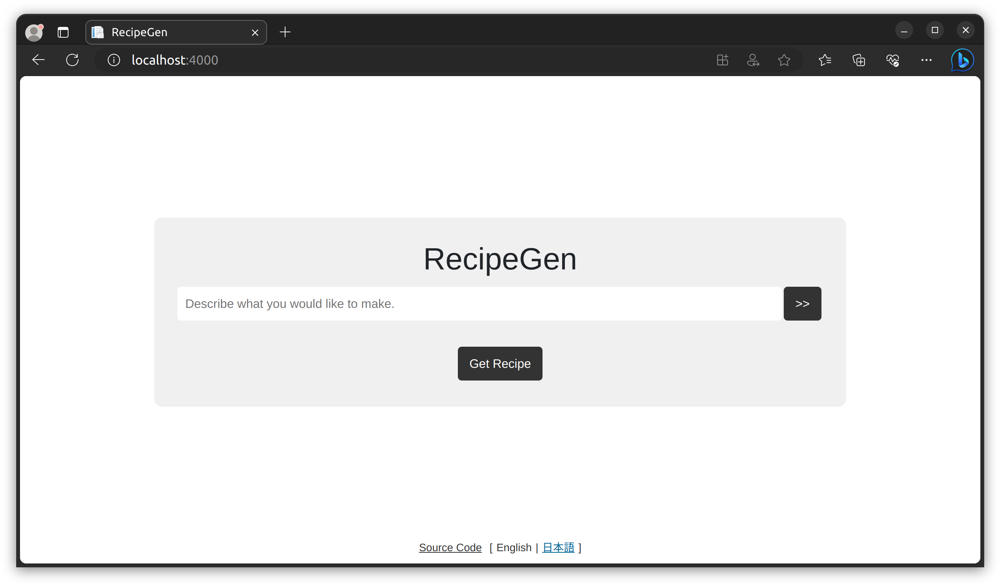
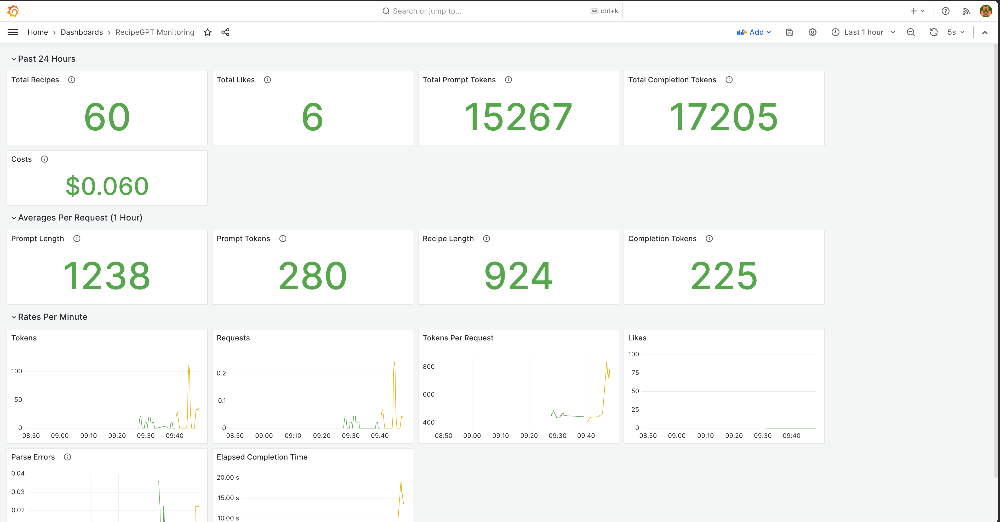

# RecipeGen - Generative AI-Powered Recipe Creator

Welcome to RecipeGen, an open-source application powered by Generative AI that curates innovative and unique recipes based on your descriptions. Whether you're craving a "delicious crispy salad", need an "appetizer for a pirate-themed party", or wish to blend two different cuisines, RecipeGen is here to assist.

There is a working version of RecipeGen with a few extra features running at [YumPop.ai](https://yumpop.ai).



This project is implemented using ASP.NET Core 7 WebAPI and a React client. It can use either the [OpenAI](https://platform.openai.com/overview) or [Azure OpenAI](https://azure.microsoft.com/en-us/products/cognitive-services/openai-service/) services.

## Getting Started

Should you encounter any issues getting started, please create an issue. 

### Prerequisites

Before you begin, ensure you have met the following requirements:

- You have obtained a key from either [OpenAI](https://platform.openai.com/overview) or [Azure OpenAI](https://azure.microsoft.com/en-us/products/cognitive-services/openai-service/) services. 
- You have installed the latest version of [Docker](https://www.docker.com/products/docker-desktop) and [Visual Studio Code](https://code.visualstudio.com/Download) (if not using Codespaces).
- You have a basic understanding of ASP.NET Core, React, and Generative AI.

### Running RecipeGen

The most straightforward way to run the application is with Docker:

**OpenAI**
```bash
docker run -e OpenAiKey=<your OpenAI key> -p 8080:8080 ghcr.io/drewby/recipegen:main
```

**Azure OpenAI**
```bash
docker run -e AzureOpenAIUri=<your Azure OpenAI Uri> -e AzureOpenAiKey=<your Azure OpenAI key> -e OpenAIModelName=<your model deployment name> -p 8080:8080 ghcr.io/drewby/recipegen:main
```

After launching, you can open your browser and navigate to http://localhost:8080 to start creating recipes.

You can also run the application in the provided `devcontainer` using a tool like [Visual Studio Code](https://code.visualstudio.com/), or in [GitHub Codespaces](https://docs.github.com/en/codespaces/overview). This will allow you to modify parts of the application and experiment.

If you create a Github Codespace, you can skip the first two steps below.

1. **Fork and clone the repository**:

    ```
    git clone https://github.com/drewby/RecipeGen.git
    ```

2. **Open the project in Visual Studio Code**: Upon opening, you will be prompted to "Reopen in Container". This will initiate the build of the Docker container.

3. **Set Environment Variables**: Populate either the `OpenAIKey` or the `AzureOpenAIUri` and `AzureOpenAIKey` values in a new `.env` file in the root of the project. For Azure OpenAI, you'll also want to define the `OpenAIModelName` which should match the name you gave your deployment. There is a `.env.sample` for reference.

4. **Start the webapi**: Press `F5` or `Shift-F5`. 

5. **Start the React client**: Open a terminal with ```Ctrl-Shift-` ```. Change directories to `src/app`. Run `npm start`.  

## Using RecipeGen

Interacting with RecipeGen is simple and intuitive.

1. **Get Started**: Click on `Get Recipe` to let RecipeGen generate a random recipe for you.

2. **Customization**: You can customize the recipe by typing any description in the provided input box. This could be a specific dish you have in mind or a general idea of what you want to eat. 

3. **Advanced Options**: For more specific requirements, click on the `>> options` button. Here, you can:
   - **Add Ingredients**: Specify what ingredients you want in your recipe.
   - **Exclude Ingredients**: Mention any ingredients you want to avoid.
   - **Specify Allergies**: Indicate any food allergies.
   - **Diet Restrictions**: Mention any dietary restrictions, like vegetarian, vegan, gluten-free, etc.
   - **World Cuisines**: Select specific cuisines, such as Italian, Mexican, Chinese, etc.
   - **Meal Types**: Specify the type of meal like breakfast, lunch, dinner, snack, etc.
   - **Dish Types**: Choose the type of dish you want to cook, like dessert, main course, appetizer, etc.

## Configuration Options

Below are the configuration options for RecipeGen. These can be set either in the `appsettings.json` file or as environment variables in the `.env` file.

- `Logging.LogLevel.Default`: Controls the default log level for the application.
- `AllowedHosts`: Defines the hosts allowed to access the application. Setting this to "*" permits all hosts.
- `OpenAIKey`: Your OpenAI key if you're using OpenAI service directly.
- `AzureOpenAIUri`: Your Azure OpenAI Uri, if you're using the Azure OpenAI service.
- `AzureOpenAIKey`: Your Azure OpenAI key, if you're using the Azure OpenAI service.
- `PromptFile`: The path and filename for the prompt template.
- `OpenAIModelName`: The model name of the OpenAI service to use. For Azure OpenAI users, this is the name given to your model deployment. For OpenAI service users, this is the actual model name (e.g., "gpt-3.5-turbo").
- `OpenAIMaxTokens`: The maximum number of tokens that the model will generate for each prompt.
- `OpenAIFrequencyPenalty`: The penalty for using more frequent tokens (range: -2.0 to 2.0).
- `OpenAITemperature`: A parameter controlling the randomness of the models output. Higher values generate more random output (range: 0 to 2).
- `OpenAIPresencePenalty`: The penalty for using new tokens (range: -2.0 to 2.0).

Note: If both `OpenAIKey` and `AzureOpenAIKey` are provided, the application will default to using Azure.

Refer to the `.env.sample` in the root of the project for a reference configuration.

## Observability 

Observability is a crucial attribute of RecipeGen, allowing us to monitor and understand the application's behavior, user interactions, and the performance of the underlying Generative AI model. It offers real-time insights into the system, supporting data-driven decisions for continuous improvement.

The dev container includes an instance of [Prometheus](https://prometheus.io) at http://localhost:9090, which gathers metrics from the running application. There is also an instance of [Grafana](https://grafana.com) at http://localhost:3000 with a built-in dashboard for visualizing the metrics.

Here's an overview of the key metrics set up for RecipeGen, their unit of measurement, and the insights they provide:

1. **`recipegen_recipecount`** (_count_): This counts the total number of recipes generated, indicating the system's overall usage.

1. **`recipegen_promptlength`** (_bytes_): This tracks the length of the prompt. It's useful in studying the complexity of requests and understanding the user interactions. The prompt length is impacted by the prompt template as well as the number of inputs from the user.

1. **`recipegen_recipelength`** (_bytes_): This measures the length of the recipe generated. This metric can provide insights into the complexity of the generated recipes and how changes to the prompt impact the complexity.

1. **`recipegen_recipetime`** (_ms_): This measures the time taken to generate a recipe. It's an essential metric for performance analysis and optimization.

1. **`recipegen_completiontokens`** (_count_): This counts the number of tokens generated as part of the chat completion. 

1. **`recipegen_prompttokens`** (_count_): This tracks the number of prompt tokens generated, providing a measure of the complexity of the input.

1. **`recipegen_likedrecipes`** (_count_): This counts the number of recipes that users liked, offering a useful proxy for user satisfaction and the quality of the model's outputs for a given prompt template.

1. **`recipegen_dislikedrecipes`** (_count_): This counts the number of recipes that users disliked.

1. **`recipegen_parseerror`** (_count_): This counts the number of errors occuring when parsing the response from the OpenAI model.

Along with the above, we include several tags/attributes with each metric.

- `maxtokens` 
- `frequencypenalty`
- `presencepenalty`
- `temperature`
- `model`
- `prompttemplate`
- `finishreason`
- `language`

With these metrics, we can build various visualizations and a monitoring dashboards. An example is below. Note that in the visualizations with both green and yellow, there was a change in prompt template.



Of course, these visualizations will become more interesting with more usage of the service.

Based on these metrics, we can make data-driven decisions to optimize how we use the Large Language Model. For instance, adjust parameters like temperature, frequency penalty, or presence penalty to see if they impact the complexity and quality of recipes generated. If the `finishreason` tag frequently shows 'length', indicating that the model often runs out of tokens, we may consider increasing the `maxtokens` limit. 

Furthermore, monitoring the rate of recipe generation (`recipegen_recipecount`) and the rate of token usage (`recipegen_prompttokens` + `recipegen_completiontokens`) is important due to the rate limits imposed by the OpenAI service on the number of Requests Per Minute (RPM) and Tokens Per Minute (TPM). If we approach these limits, we may need to adjust our service usage or consider scaling up.

We can also estimate our real-time costs by calculating the token usage with the pricing provided by the OpenAI or Azure OpenAI servicees.

The observability features in RecipeGen facilitate a continuous feedback loop that can help us improve system performance and the user experience.

## Contributing to RecipeGen

Interested in contributing to RecipeGen? Follow the guidelines provided in the [CONTRIBUTING.md](CONTRIBUTING.md) file.

## License

This project uses the [MIT](LICENSE) license.
